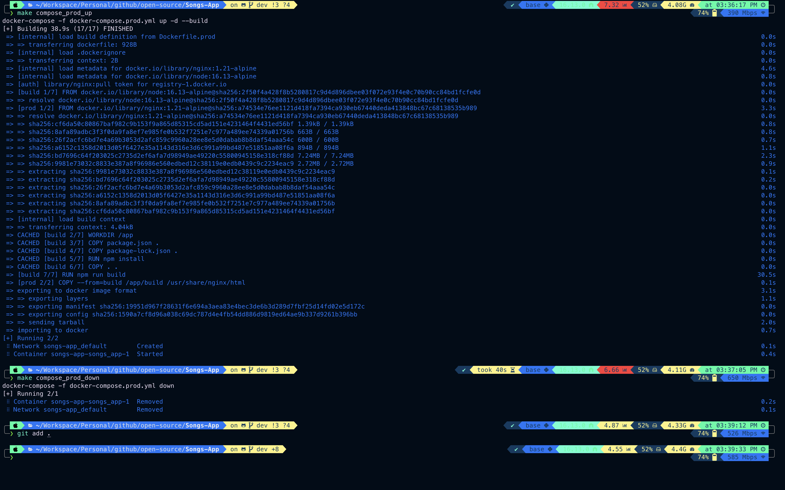

## Install and Run:

1. To install the dependencies:

    npm install

2. To run the application:

    npm run start

## Build and Compile:

2. To build and compile the project into an optimized build:

    npm run build

## Build and Run using docker across different modes:

1. To build and run the Songs-App in `development` mode:

    docker-compose -f docker-compose.dev.yml up -d --build

2. To build and run the Songs-App in `production` mode (using `Nginx`):

    docker-compose -f docker-compose.prod.yml up -d --build

3. To stop the containers all at once:

    docker-compose -f docker-compose.dev.yml down

or 

    docker-compose -f docker-compose.prod.yml down

## Build and Run using Makefile:

1. Run and build in `development` mode:

    make compose_dev_up

2. Run and build in `production` mode:

    make compose_prod_up

3. Stop the containers all at once:

    make compose_dev_down

or 

    make compose_prod_down

4. Demo of the above example:

